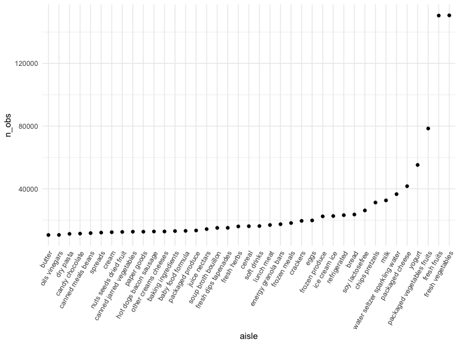
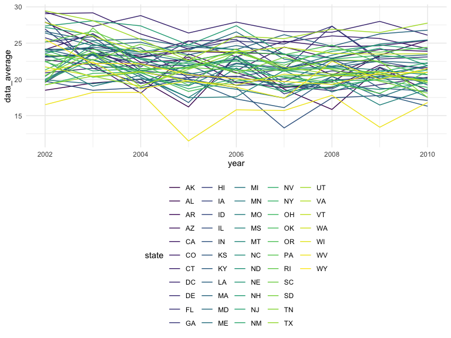

p8105_hw2_khs2318
================
Kayla Schiffer-Kane
2023-10-04

- [Problem 1](#problem-1)
  - [Load dataset](#load-dataset)
  - [Describe dataset](#describe-dataset)
- [Problem 2](#problem-2)
  - [Load and Clean Dataset](#load-and-clean-dataset)
  - [Data Analysis](#data-analysis)
    - [Locations by State](#locations-by-state)
    - [“Excellent” Responses](#excellent-responses)

# Problem 1

## Load dataset

``` r
data("instacart")
insta_df = instacart 
#skimr::skim(insta_df)
#length(unique(insta_df$aisle_id)) # 134 
```

## Describe dataset

**Write a short description of the dataset, noting the size and
structure of the data, describing some key variables, and giving
illustrative examples of observations.**

The dataset has 1384617 rows and 15 columns. Each row represents a
product with a unique ID and details of its order (day and time), as
well as details of the product. `add_to_cart_order` is a numerical
variable that indicates the order in which items were added to the cart.
`aisle_id` and `department_id` are similar numeric variables that
indicate which aisle and department the product is found in. There are
also product names (e.g., Bulgarian Yogurt, Organic 4% Milk Fat Whole
Milk Cottage Cheese), aisle names (e.g., yogurt, other creams cheeses),
and department names (e.g., dairy eggs, produce).

**How many aisles are there, and which aisles are the most items ordered
from?** There are 134 aisles, and the most items are ordered from fresh
vegetables and fresh fruits

``` r
ailse_ct = 
  insta_df |>
  group_by(aisle) |>
  summarize(n_obs = n()) |>
  arrange(desc(n_obs))
```

**Make a plot that shows the number of items ordered in each aisle,
limiting this to aisles with more than 10000 items ordered. Arrange
aisles sensibly, and organize your plot so others can read it.**

``` r
ailse_ct |>
  filter(n_obs > 10000) |> 
  mutate(aisle = fct_reorder(aisle, n_obs)) |> 
  ggplot(aes(x = aisle, y = n_obs)) + 
  geom_point() + 
  theme(axis.text.x = element_text(angle = 60, hjust = 1))
```



**Make a table showing the three most popular items in each of the
aisles “baking ingredients”, “dog food care”, and “packaged vegetables
fruits”. Include the number of times each item is ordered in your
table.**

``` r
insta_df |>
  filter(aisle %in% c("baking ingredients","dog food care","packaged vegetables fruits")) |>
  group_by(aisle, product_name) |>
  summarize(n_obs = n()) |>
  filter(min_rank(desc(n_obs)) < 4) |>
  arrange(desc(n_obs)) |>
  knitr::kable()
```

| aisle                      | product_name                                  | n_obs |
|:---------------------------|:----------------------------------------------|------:|
| packaged vegetables fruits | Organic Baby Spinach                          |  9784 |
| packaged vegetables fruits | Organic Raspberries                           |  5546 |
| packaged vegetables fruits | Organic Blueberries                           |  4966 |
| baking ingredients         | Light Brown Sugar                             |   499 |
| baking ingredients         | Pure Baking Soda                              |   387 |
| baking ingredients         | Cane Sugar                                    |   336 |
| dog food care              | Snack Sticks Chicken & Rice Recipe Dog Treats |    30 |
| dog food care              | Organix Chicken & Brown Rice Recipe           |    28 |
| dog food care              | Small Dog Biscuits                            |    26 |

**Make a table showing the mean hour of the day at which Pink Lady
Apples and Coffee Ice Cream are ordered on each day of the week; format
this table for human readers (i.e. produce a 2 x 7 table).**

``` r
insta_df |>
  filter(product_name %in% c("Pink Lady Apples","Coffee Ice Cream")) |>
  group_by(product_name, order_dow) |>
  summarize(mean_hour = mean(order_hour_of_day)) |> 
  pivot_wider(names_from = order_dow,
              values_from = mean_hour) |>
  knitr::kable()
```

| product_name     |        0 |        1 |        2 |        3 |        4 |        5 |        6 |
|:-----------------|---------:|---------:|---------:|---------:|---------:|---------:|---------:|
| Coffee Ice Cream | 13.77419 | 14.31579 | 15.38095 | 15.31818 | 15.21739 | 12.26316 | 13.83333 |
| Pink Lady Apples | 13.44118 | 11.36000 | 11.70213 | 14.25000 | 11.55172 | 12.78431 | 11.93750 |

# Problem 2

## Load and Clean Dataset

First, do some data cleaning:

format the data to use appropriate variable names; focus on the “Overall
Health” topic include only responses from “Excellent” to “Poor” organize
responses as a factor taking levels ordered from “Poor” to “Excellent”

``` r
library(p8105.datasets)
data("brfss_smart2010")
brfss_data = 
  brfss_smart2010 |>
  janitor::clean_names() |>
  rename(state = locationabbr,  county = locationdesc, 
         resp_id = respid) |>
  filter(topic == "Overall Health" & response %in% c("Excellent", "Poor")) |>
  mutate(response = factor(response, levels = c("Poor", "Excellent"), ordered = TRUE))
skimr::skim(brfss_data)
```

|                                                  |            |
|:-------------------------------------------------|:-----------|
| Name                                             | brfss_data |
| Number of rows                                   | 4250       |
| Number of columns                                | 23         |
| \_\_\_\_\_\_\_\_\_\_\_\_\_\_\_\_\_\_\_\_\_\_\_   |            |
| Column type frequency:                           |            |
| character                                        | 16         |
| factor                                           | 1          |
| numeric                                          | 6          |
| \_\_\_\_\_\_\_\_\_\_\_\_\_\_\_\_\_\_\_\_\_\_\_\_ |            |
| Group variables                                  | None       |

Data summary

**Variable type: character**

| skim_variable              | n_missing | complete_rate | min | max | empty | n_unique | whitespace |
|:---------------------------|----------:|--------------:|----:|----:|------:|---------:|-----------:|
| state                      |         0 |             1 |   2 |   2 |     0 |       51 |          0 |
| county                     |         0 |             1 |  15 |  33 |     0 |      404 |          0 |
| class                      |         0 |             1 |  13 |  13 |     0 |        1 |          0 |
| topic                      |         0 |             1 |  14 |  14 |     0 |        1 |          0 |
| question                   |         0 |             1 |  27 |  27 |     0 |        1 |          0 |
| data_value_unit            |         0 |             1 |   1 |   1 |     0 |        1 |          0 |
| data_value_type            |         0 |             1 |  16 |  16 |     0 |        1 |          0 |
| data_value_footnote_symbol |      4242 |             0 |   1 |   1 |     0 |        1 |          0 |
| data_value_footnote        |      4242 |             0 | 197 | 197 |     0 |        1 |          0 |
| data_source                |         0 |             1 |   5 |   5 |     0 |        1 |          0 |
| class_id                   |         0 |             1 |   7 |   7 |     0 |        1 |          0 |
| topic_id                   |         0 |             1 |   7 |   7 |     0 |        1 |          0 |
| location_id                |      4250 |             0 |  NA |  NA |     0 |        0 |          0 |
| question_id                |         0 |             1 |   7 |   7 |     0 |        1 |          0 |
| resp_id                    |         0 |             1 |   7 |   7 |     0 |        2 |          0 |
| geo_location               |         0 |             1 |  20 |  24 |     0 |      404 |          0 |

**Variable type: factor**

| skim_variable | n_missing | complete_rate | ordered | n_unique | top_counts           |
|:--------------|----------:|--------------:|:--------|---------:|:---------------------|
| response      |         0 |             1 | TRUE    |        2 | Poo: 2125, Exc: 2125 |

**Variable type: numeric**

| skim_variable         | n_missing | complete_rate |    mean |     sd |     p0 |    p25 |    p50 |    p75 |   p100 | hist  |
|:----------------------|----------:|--------------:|--------:|-------:|-------:|-------:|-------:|-------:|-------:|:------|
| year                  |         0 |             1 | 2006.55 |   2.47 | 2002.0 | 2005.0 | 2007.0 | 2009.0 | 2010.0 | ▅▆▃▇▇ |
| sample_size           |         0 |             1 |   92.40 | 106.61 |    2.0 |   27.0 |   62.0 |  115.0 | 1166.0 | ▇▁▁▁▁ |
| data_value            |         8 |             1 |   12.94 |   9.72 |    0.4 |    3.6 |   10.5 |   22.0 |   43.2 | ▇▁▆▂▁ |
| confidence_limit_low  |         0 |             1 |    9.78 |   8.35 |    0.0 |    1.9 |    6.0 |   17.5 |   36.5 | ▇▂▅▁▁ |
| confidence_limit_high |         0 |             1 |   16.00 |  11.20 |    0.0 |    5.1 |   14.0 |   26.3 |   49.9 | ▇▁▆▂▁ |
| display_order         |         0 |             1 |    3.00 |   2.00 |    1.0 |    1.0 |    3.0 |    5.0 |    5.0 | ▇▁▁▁▇ |

## Data Analysis

### Locations by State

In 2002, which states were observed at 7 or more locations? What about
in 2010?

- Because `location_id` are all NA, using `geo_locaiton` as the best
  measure of different locations. County could also be used, but some
  locations may be within a single county.

``` r
locations_2002 = 
  brfss_data |>
  filter(year == 2002) |>
  group_by(state) |>
  summarize(
    n_obs = n(),
    n_location = n_distinct(geo_location)) |> 
  filter(n_location >= 7)
head(locations_2002, n=5)
```

    ## # A tibble: 5 × 3
    ##   state n_obs n_location
    ##   <chr> <int>      <int>
    ## 1 CT       14          7
    ## 2 FL       14          7
    ## 3 MA       16          8
    ## 4 NC       14          7
    ## 5 NJ       16          8

``` r
locations_2010 = 
  brfss_data |>
  filter(year == 2010) |>
  group_by(state) |>
  summarize(
    n_obs = n(),
    n_location = n_distinct(geo_location)) |> 
  filter(n_location >= 7)
head(locations_2010, n=5)
```

    ## # A tibble: 5 × 3
    ##   state n_obs n_location
    ##   <chr> <int>      <int>
    ## 1 CA       24         12
    ## 2 CO       14          7
    ## 3 FL       82         41
    ## 4 MA       18          9
    ## 5 MD       24         12

There are 6 states observed at 7 or more locations in 2002 (including
Connecticut, Florida, and Massachusetts), and 14 in 2010 (including
California, Colorado, and Florida.

### “Excellent” Responses

Construct a dataset that is limited to Excellent responses, and
contains, year, state, and a variable that averages the data_value
across locations within a state.

``` r
exc_dataset = 
  brfss_data |>
  filter(response == "Excellent") |>
  group_by(year, state) |>
  summarize(n_obs = n(), 
            data_average = mean(data_value))
head(exc_dataset)
```

    ## # A tibble: 6 × 4
    ## # Groups:   year [1]
    ##    year state n_obs data_average
    ##   <int> <chr> <int>        <dbl>
    ## 1  2002 AK        1         27.9
    ## 2  2002 AL        1         18.5
    ## 3  2002 AR        1         24.1
    ## 4  2002 AZ        2         24.1
    ## 5  2002 CA        1         22.7
    ## 6  2002 CO        4         23.1

Make a “spaghetti” plot of this average value over time within a state
(that is, make a plot showing a line for each state across years – the
geom_line geometry and group aesthetic will help).

``` r
exc_dataset |>
  ggplot(aes(x = year, y = data_average)) + 
  geom_line(aes(group = state, colour = state)) 
```



Make a two-panel plot showing, for the years 2006, and 2010,
distribution of data_value for responses (“Poor” to “Excellent”) among
locations in NY State.

``` r
ny_dataset = 
  brfss_data |>
  filter(year %in% c(2006, 2010) & state == 'NY') |>
  mutate(year = as.factor(year))

ny_dataset |>
  ggplot(aes(x = data_value, fill = year)) + 
  geom_histogram(position = "dodge", binwidth = 0.5) + 
  facet_grid(.~year)
```


