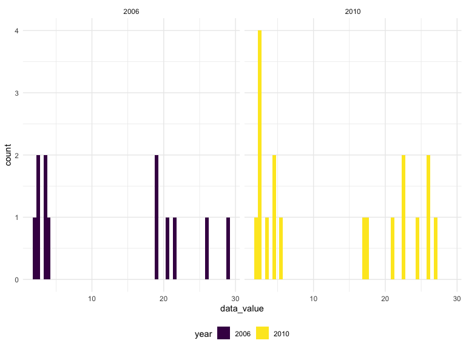

p8105_hw2_khs2318
================
Kayla Schiffer-Kane
2023-10-04

- [Problem 1](#problem-1)
  - [Load dataset](#load-dataset)
  - [Describe dataset](#describe-dataset)
- [Problem 2](#problem-2)
  - [Load and Clean Dataset](#load-and-clean-dataset)
  - [Data Analysis](#data-analysis)
    - [Locations by State](#locations-by-state)
    - [“Excellent” Responses](#excellent-responses)
    - [NY state: 2006, 2010](#ny-state-2006-2010)
- [Problem 3](#problem-3)
  - [Load and Tidy NHANES Datasets](#load-and-tidy-nhanes-datasets)
    - [Merge NHANES](#merge-nhanes)
  - [Men and Women, Education and Age](#men-and-women-education-and-age)
  - [Accelemator Analyses](#accelemator-analyses)
  - [Daily Accelerometer](#daily-accelerometer)

# Problem 1

## Load dataset

``` r
data("instacart")
insta_df = instacart 
#skimr::skim(insta_df)
#length(unique(insta_df$aisle_id)) # 134 
```

## Describe dataset

**Write a short description of the dataset, noting the size and
structure of the data, describing some key variables, and giving
illustrative examples of observations.**

The dataset has 1384617 rows and 15 columns. Each row represents a
product with a unique ID and details of its order (day and time), as
well as details of the product. `add_to_cart_order` is a numerical
variable that indicates the order in which items were added to the cart.
`aisle_id` and `department_id` are similar numeric variables that
indicate which aisle and department the product is found in. There are
also product names (e.g., Bulgarian Yogurt, Organic 4% Milk Fat Whole
Milk Cottage Cheese), aisle names (e.g., yogurt, other creams cheeses),
and department names (e.g., dairy eggs, produce).

**How many aisles are there, and which aisles are the most items ordered
from?** There are 134 aisles, and the most items are ordered from fresh
vegetables and fresh fruits

``` r
ailse_ct = 
  insta_df |>
  group_by(aisle) |>
  summarize(n_obs = n()) |>
  arrange(desc(n_obs))
```

**Make a plot that shows the number of items ordered in each aisle,
limiting this to aisles with more than 10000 items ordered. Arrange
aisles sensibly, and organize your plot so others can read it.**

``` r
ailse_ct |>
  filter(n_obs > 10000) |> 
  mutate(aisle = fct_reorder(aisle, n_obs)) |> 
  ggplot(aes(x = aisle, y = n_obs)) + 
  geom_point() + 
  theme(axis.text.x = element_text(angle = 60, hjust = 1))
```


**Make a table showing the three most popular items in each of the
aisles “baking ingredients”, “dog food care”, and “packaged vegetables
fruits”. Include the number of times each item is ordered in your
table.**

``` r
insta_df |>
  filter(aisle %in% c("baking ingredients","dog food care","packaged vegetables fruits")) |>
  group_by(aisle, product_name) |>
  summarize(n_obs = n()) |>
  filter(min_rank(desc(n_obs)) < 4) |>
  arrange(desc(n_obs)) |>
  knitr::kable()
```

| aisle                      | product_name                                  | n_obs |
|:---------------------------|:----------------------------------------------|------:|
| packaged vegetables fruits | Organic Baby Spinach                          |  9784 |
| packaged vegetables fruits | Organic Raspberries                           |  5546 |
| packaged vegetables fruits | Organic Blueberries                           |  4966 |
| baking ingredients         | Light Brown Sugar                             |   499 |
| baking ingredients         | Pure Baking Soda                              |   387 |
| baking ingredients         | Cane Sugar                                    |   336 |
| dog food care              | Snack Sticks Chicken & Rice Recipe Dog Treats |    30 |
| dog food care              | Organix Chicken & Brown Rice Recipe           |    28 |
| dog food care              | Small Dog Biscuits                            |    26 |

**Make a table showing the mean hour of the day at which Pink Lady
Apples and Coffee Ice Cream are ordered on each day of the week; format
this table for human readers (i.e. produce a 2 x 7 table).**

``` r
insta_df |>
  filter(product_name %in% c("Pink Lady Apples","Coffee Ice Cream")) |>
  group_by(product_name, order_dow) |>
  summarize(mean_hour = mean(order_hour_of_day)) |> 
  pivot_wider(names_from = order_dow,
              values_from = mean_hour) |>
  knitr::kable()
```

| product_name     |        0 |        1 |        2 |        3 |        4 |        5 |        6 |
|:-----------------|---------:|---------:|---------:|---------:|---------:|---------:|---------:|
| Coffee Ice Cream | 13.77419 | 14.31579 | 15.38095 | 15.31818 | 15.21739 | 12.26316 | 13.83333 |
| Pink Lady Apples | 13.44118 | 11.36000 | 11.70213 | 14.25000 | 11.55172 | 12.78431 | 11.93750 |

# Problem 2

## Load and Clean Dataset

- Format the data to use appropriate variable names;
- Focus on the “Overall Health” topic
- Include only responses from “Excellent” to “Poor”
- Organize responses as a factor taking levels ordered from “Poor” to
  “Excellent”

``` r
library(p8105.datasets)
data("brfss_smart2010")
brfss_data = 
  brfss_smart2010 |>
  janitor::clean_names() |>
  rename(state = locationabbr,  county = locationdesc, 
         resp_id = respid) |>
  filter(topic == "Overall Health" & response %in% c("Excellent", "Poor")) |>
  mutate(response = factor(response, levels = c("Poor", "Excellent"), ordered = TRUE))
```

## Data Analysis

### Locations by State

**In 2002, which states were observed at 7 or more locations? What about
in 2010?**

- Because `location_id` are all NA, using `geo_locaiton` as the best
  measure of different locations. County could also be used, but some
  locations may be within a single county.

``` r
locations_2002 = 
  brfss_data |>
  filter(year == 2002) |>
  group_by(state) |>
  summarize(
    n_obs = n(),
    n_location = n_distinct(geo_location)) |> 
  filter(n_location >= 7)
head(locations_2002, n=5)
```

    ## # A tibble: 5 × 3
    ##   state n_obs n_location
    ##   <chr> <int>      <int>
    ## 1 CT       14          7
    ## 2 FL       14          7
    ## 3 MA       16          8
    ## 4 NC       14          7
    ## 5 NJ       16          8

``` r
locations_2010 = 
  brfss_data |>
  filter(year == 2010) |>
  group_by(state) |>
  summarize(
    n_obs = n(),
    n_location = n_distinct(geo_location)) |> 
  filter(n_location >= 7)
head(locations_2010, n=5)
```

    ## # A tibble: 5 × 3
    ##   state n_obs n_location
    ##   <chr> <int>      <int>
    ## 1 CA       24         12
    ## 2 CO       14          7
    ## 3 FL       82         41
    ## 4 MA       18          9
    ## 5 MD       24         12

There are 6 states observed at 7 or more locations in 2002 (including
Connecticut, Florida, and Massachusetts), and 14 in 2010 (including
California, Colorado, and Florida.

### “Excellent” Responses

**Construct a dataset that is limited to Excellent responses, and
contains, year, state, and a variable that averages the data_value
across locations within a state.**

``` r
exc_dataset = 
  brfss_data |>
  filter(response == "Excellent") |>
  group_by(year, state) |>
  summarize(n_obs = n(), 
            data_average = mean(data_value))
head(exc_dataset)
```

    ## # A tibble: 6 × 4
    ## # Groups:   year [1]
    ##    year state n_obs data_average
    ##   <int> <chr> <int>        <dbl>
    ## 1  2002 AK        1         27.9
    ## 2  2002 AL        1         18.5
    ## 3  2002 AR        1         24.1
    ## 4  2002 AZ        2         24.1
    ## 5  2002 CA        1         22.7
    ## 6  2002 CO        4         23.1

**Make a “spaghetti” plot of this average value over time within a state
(that is, make a plot showing a line for each state across years – the
geom_line geometry and group aesthetic will help).**

``` r
exc_dataset |>
  ggplot(aes(x = year, y = data_average)) + 
  geom_line(aes(group = state, colour = state)) 
```


### NY state: 2006, 2010

**Make a two-panel plot showing, for the years 2006, and 2010,
distribution of data_value for responses (“Poor” to “Excellent”) among
locations in NY State.**

``` r
ny_dataset = 
  brfss_data |>
  filter(year %in% c(2006, 2010) & state == 'NY') |>
  mutate(year = as.factor(year))

ny_dataset |>
  ggplot(aes(x = data_value, fill = year)) + 
  geom_histogram(position = "dodge", binwidth = 0.5) + 
  facet_grid(.~year)
```



# Problem 3

## Load and Tidy NHANES Datasets

**Load, tidy, merge, and otherwise organize the data sets. Your final
dataset should include all originally observed variables; exclude
participants less than 21 years of age, and those with missing
demographic data; and encode data with reasonable variable classes
(i.e. not numeric, and using factors with the ordering of tables and
plots in mind).**

``` r
demo_df = 
  read_csv('./data/nhanes_covar.csv', skip = 4) |>
  janitor::clean_names() |>
  mutate(sex = recode(sex, "2" = "Female", "1" = "Male")) |>
  mutate(sex = factor(sex, levels = c("Male", "Female"), ordered = TRUE)) |>
  mutate(education = recode(education, "1" = "hs_less", "2" = "hs_equiv", "3" = "hs_more")) |>
  mutate(education = factor(education, levels = c("hs_less", "hs_equiv","hs_more"), ordered = TRUE)) |>
  filter(age >= 21) |> 
  filter(!is.na(sex) & !is.na(age) & !is.na(education) & !is.na(bmi)) 

accel_df =
  read_csv('./data/nhanes_accel.csv') |>
  janitor::clean_names()
```

### Merge NHANES

``` r
nhanes_df = 
  left_join(demo_df, accel_df, by = "seqn")
head(nhanes_df)
```

    ## # A tibble: 6 × 1,445
    ##    seqn sex      age   bmi education  min1  min2  min3  min4   min5   min6  min7
    ##   <dbl> <ord>  <dbl> <dbl> <ord>     <dbl> <dbl> <dbl> <dbl>  <dbl>  <dbl> <dbl>
    ## 1 62161 Male      22  23.3 hs_equiv  1.11  3.12  1.47  0.938 1.60   0.145  2.10 
    ## 2 62164 Female    44  23.2 hs_more   1.92  1.67  2.38  0.935 2.59   5.22   2.39 
    ## 3 62169 Male      21  20.1 hs_equiv  5.85  5.18  4.76  6.48  6.85   7.24   6.12 
    ## 4 62174 Male      80  33.9 hs_more   5.42  3.48  3.72  3.81  6.85   4.45   0.561
    ## 5 62177 Male      51  20.1 hs_equiv  6.14  8.06  9.99  6.60  4.57   2.78   7.10 
    ## 6 62178 Male      80  28.5 hs_equiv  0.167 0.429 0.131 1.20  0.0796 0.0487 0.106
    ## # ℹ 1,433 more variables: min8 <dbl>, min9 <dbl>, min10 <dbl>, min11 <dbl>,
    ## #   min12 <dbl>, min13 <dbl>, min14 <dbl>, min15 <dbl>, min16 <dbl>,
    ## #   min17 <dbl>, min18 <dbl>, min19 <dbl>, min20 <dbl>, min21 <dbl>,
    ## #   min22 <dbl>, min23 <dbl>, min24 <dbl>, min25 <dbl>, min26 <dbl>,
    ## #   min27 <dbl>, min28 <dbl>, min29 <dbl>, min30 <dbl>, min31 <dbl>,
    ## #   min32 <dbl>, min33 <dbl>, min34 <dbl>, min35 <dbl>, min36 <dbl>,
    ## #   min37 <dbl>, min38 <dbl>, min39 <dbl>, min40 <dbl>, min41 <dbl>, …

## Men and Women, Education and Age

**Produce a reader-friendly table for the number of men and women in
each education category, and create a visualization of the age
distributions for men and women in each education category. Comment on
these items.**

``` r
nhanes_df |>
  group_by(education, sex) |>
  summarize(n_indiv = n()) |>
  knitr::kable()
```

| education | sex    | n_indiv |
|:----------|:-------|--------:|
| hs_less   | Male   |      27 |
| hs_less   | Female |      28 |
| hs_equiv  | Male   |      35 |
| hs_equiv  | Female |      23 |
| hs_more   | Male   |      56 |
| hs_more   | Female |      59 |

``` r
nhanes_df |>
  ggplot(aes(x = age, fill = education)) +
  geom_density(alpha = 0.4, adjust = 0.5) +
  facet_grid(.~ sex)
```


There is a roughly even split of Male versus Female for education levels
of less than or more than high school. For high school equivalent, there
are more Males (60.34%) than Females (39.66%). For both Males and
Females, but for Females in particular, participants with more than high
school education are moslty young (\< 40). For Females in particular,
the older participants (\>60) seem to have more concentration of less
than or equivalent to high school education. The distribution of Males
with less than high swchool education seem to be largely beteen ages
40-50 or greater than 60.

## Accelemator Analyses

**Traditional analyses of accelerometer data focus on the total activity
over the day. Using your tidied dataset, aggregate across minutes to
create a total activity variable for each participant. Plot these total
activities (y-axis) against age (x-axis); your plot should compare men
to women and have separate panels for each education level. Include a
trend line or a smooth to illustrate differences. Comment on your
plot.**

``` r
total_activity = 
  nhanes_df |>
  pivot_longer(min1:min1440, 
               names_to = "min",
               values_to = "min_value") |>
  group_by(seqn, age, sex, education) |>
  summarize(n_obs = n(),
            total_activity = sum(min_value))

total_activity |>
  ggplot(aes(x = age, y = total_activity, color = sex)) + 
  geom_point() + 
  geom_smooth(se = FALSE) + 
  facet_grid(. ~ education)
```


## Daily Accelerometer

Accelerometer data allows the inspection activity over the course of the
day. Make a three-panel plot that shows the 24-hour activity time
courses for each education level and use color to indicate sex. Describe
in words any patterns or conclusions you can make based on this graph;
including smooth trends may help identify differences.
